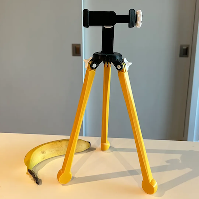
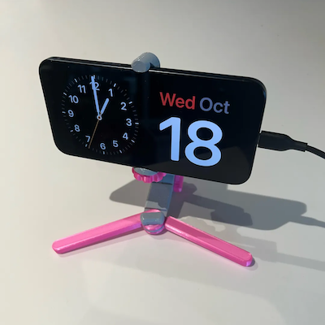

# DoomScroller

A 3D-printed smartphone tripod and harm reduction tool for doomscrolling, designed with accessibility in mind.

# Overview
Originally designed for use during the COVID pandemic lockdowns, the DoomScroller and Mini DoomScroller are tripods for securely mount devices like smartphones, tablets, GoPros, and other rectangular prism objects.

## Features
1. Open source 3D model
    1. Remixed [popular, proven designs](#origin-story) on Thingiverse.
    1. Made in [OnShape CAD](https://cad.onshape.com/documents/ee0d92fdf6736f8a494244af/w/14bbf8e148085a817d797314/e/513b945eaf0116b0d17e9980?renderMode=0&uiState=65944536be34dc4e93d4e8f1) free plan, which requires that models be shared openly.
1. Wider applications than traditional tripods and stands for electronic devices
    1. Ball joint enables wider viewing angles and orientations.
    1. Adjustable legs allow for use on uneven surfaces, such as beds, couches, and reclining chairs.
1. Portable
    1. The Mini DoomScroller folds up into a small size that can fit into a small purse, large pocket, or backpack.
1. 3D-printed
    1. Customizable design
        1. Unlike commercial, off-the-shelf smartphone tripods and stands, the DoomScroller can be printed in all your favourite colours.
        1. [Custom fastener threads](https://forum.onshape.com/discussion/4867/new-featurescript-thread-creator)
    1. Environmentally friendly
        1. Get a custom tripod without requiring a manufacturer to mass-produce and distribute a generic product.
        1. Modular design makes the DoomScroller easy to assemble, repair, and upgrade.
1. Actively developed
    1. I'm constantly pursuing a better design because I currently use the DoomScroller on a daily basis.
    1. Taking feature requests.
        1. My friend asked if I could make the DoomScroller more portable for their travels, so the Mini DoomScroller was born.
        1. GoPro functionality was requested by a user on Printables.
1. Parametric, one day
    1. Generate a custom clamp with a parametric model, once I finish the OpenSCAD design.

## Use Cases
The DoomScroller and Mini DoomScroller can be used in many applications.
1. Read social media on your smartphone in bed.
1. Watch video on your own device on a plane's tray table.
1. Join video conferencing calls like Zoom (ZoomScroller).
1. Record video where other tripods are too bulky to pack.
1. Charge your smartphone with MagSafe.
1. Use StandBy with iOS 17 on your bedside table.
1. Pair with a PanaVise [305](http://panavise.com/index.html?pageID=1&page=full&--eqskudatarq=12) or [300](http://panavise.com/index.html?pageID=1&page=full&--eqskudatarq=532) base to provide 360º horizontal rotation and 90º vertical tilt, as well as to use with other compatible PanaVise products, like [circuit board holders](http://panavise.com/index.html?pageID=1&page=full&--eqskudatarq=24).
1. Record video on a GoPro.

Print one and give it to someone in need!

I originally hosted these two projects in Thingiverse and Printables, but it became too much work to update all four pages during active development. Thus, this documentation is meant to keep me on track. I hope that moving to Github will also make it easier for future users who can't make sense of my incomplete instructions across the original project pages.

## What is doomscrolling?
[Doomscrolling](https://en.wikipedia.org/wiki/Doomscrolling), or doomsurfing, is the act of spending an excessive amount of screen time devoted to the absorption of negative news.

I took a harm reduction approach. People are probably going to be doomscrolling anyways, so you may as well try to keep yourself safe while you're at it. No need to hurt your hands, neck, or eyes if you don't have to.

## Origin Story
During one of several COVID-19 lockdowns in 2020, I started to feel some strain in my hands and neck from scrolling all of the social media timelines on my smartphone. There was nowhere to go, nobody to visit, vaccines still being developed, all a person could do during the winter months was to escape into their smartphone for work and personal reasons.

There were already some fine mounting and tripod projects on Thingiverse, so I remixed them.
- [Tripod Phone Stand (no screw ! )](https://www.thingiverse.com/thing:4694593)
- [Modular Mounting System](https://www.thingiverse.com/thing:2194278)
- [Open Source Universal Ball Joint (to reuse!)](https://www.thingiverse.com/thing:4739696)

# Getting Started
Choose your style of DoomScroller:
1. [DoomScroller](#1-doomscroller)
1. [Mini DoomScroller](#2-mini-doomscroller)

Here is a brief comparison of the tradeoffs:
| Feature | DoomScroller | Mini DoomScroller |
| -------- | -------- | -------- |
| Edition | Original | Newer |
| Location | Home | Data |
| Size | Bigger | Smaller |
| Materials | Plastic and metal | Plastic |
| Print Time (Prusa MK3S) | ~6.5 hours (150 mm legs) | ~3 hours |

# 1. DoomScroller
## Print Instructions
1. Pick a length for your DoomScroller's legs.
    - Either 150 mm (file 1a) or 220 mm (file 1b).
    - I'm 5'10" (178 cm) tall, and I prefer the 220 mm legs myself.
1. Pick a mounting style.
    1. Most users will need the Frame (file 7b).
        1. Frame also requires printing of Frame lock (file 8) and Frame screw (file 9).
    1. iPhone 12 and newer may want to use the MagFace (file 7a).
        1. MagFace also requires an Apple MagSafe charger.

CAUTION: Clamping too tightly on your device can break it; apparently plastic threads can be pretty strong. I take no responsibility for broken devices, but I have designed clamps that prevent damage by limiting the amount of threading.

To get a better sense of the smartphone use case, I made a table of physical dimensions of popular smartphones (Device sizes.csv). Still a work in progress, but sharing if it'll be useful to others.

### Non-3D-Printed Parts Required
1. Three (3) of M3x8 mm socket head cap screws
1. Three (3) of M3 hex nuts
1. Three (3) of M5x20mm hex bolt
1. Three (3) of M5 hex nuts

## Colour Schemes
You can do whatever you want here, truly, but files are organized for a two-tone colourway.
1. Dominant colours
    1. Legs (1ab)
    1. Hip (2)
    1. Neck (3)
    1. Ball Joint split (5)
    1. MagFace (7a)
    or
    1. Frame base (7b)
        1. Frame lock (8)
1. Accent colours
    1. Knob (4)
    1. Ball Joint screw (6)
    1. Frame screw (7b).

### Logos
Consider how many colours are used and how much area each one takes in the overall image. Usually there will be one or two dominant colours, and then some accent colours. You can even get different colours for the screws and nuts.
- Dominant colours: Legs, Neck, Hip, Frame Base, Frame Lock.
- Accent colours: Hip, Knob, Ball Joint Screw, Frame Screw, metal screws.

See the example photo of the Edmonton Oilers' McDavid jersey with an older prototype I made for a friend. I got lucky with this logo because of the oil derrick structure and orange oil drop look created by the ball joint.

## DoomScroller Assembly
See DoomScroller/Images/##.webp for visual assembly instructions.

# 2. Mini DoomScroller
## Print Instructions
Users have a few options for simple or semi-custom prints:
1. Mounting style
1. Amount of threading
1. Device width
1. Device depth

### Simple
1. Open plate file in PrusaSlicer as project to preserve the painted-on support settings.
    1. Mini DoomScroller - Clamp - Full Plate w100 x d15.3mf
    1. Mini DoomScroller - Clamp - Accent Colour.3mf
1. [Assemble](#mini-doomscroller-assembly).

### Semi-Custom
1. Select mounting style.
    1. MagFace
    1. GoPro
    1. Clamp
1. For clamp mounting, decide whether you want a general or single size.
    1. General size has a longer thread, allowing for devices of multiple widths and depths.
        1. Good for using DoomScrollers with devices of different sizes, e.g., sharing with other users.
    1. Single size has a shorter thread, allowing for devices of fewer widths and depths.
        1. Good for preventing damage to devices.
        1. Good for personal use and sharing with other devices of similar size.
        1. Currently only some combinations of widths and depths are available.
    1. I'm working on a parametric OpenSCAD model for the clamp. Not ready yet.
        1. This model will allow for even further customization, such as with the Thingiverse Customizer.
        
## Mini DoomScroller Assembly
See "Mini DoomScroller/Images/##.webp" files to follow along with assembly instructions.

2023-01-02: Filenames in below instructions need to be updated.

1. Insert torso.3mf and neck.3mf so that hinges are flush on both sides.
1. Insert hip-bolt.3mf into the unthreaded side of the hinge, then screw into the M12 thread of neck.3mf to tighten hinge.
1. Place ball.3mf into the spherical section in neck.3mf.
1. Place ball-joint-nut.3mf over ball.3mf, and screw onto the M22 thread of neck.3mf to tighten.
1. Screw the selected mount into the M12 thread of ball.3mf.
1. If using magface.3mf, skip to step 9.
1. Insert clamp-movable-jaw.3mf over clamp-frame.3mf.
1. Screw clamp-nut.3mf onto the M15 thread of Clamp frame.3mf.
1. Place left-leg-threaded.3mf on the underside of the joint on torso.3mf. It will sit between torso.3mf and neck.3mf when folded.
1. Place right-leg.3mf on the opposite side of the torso joint.
1. (Optional) Use leg-bolt-washer.3mf on top of right-leg.3mf. This adds length for leg-bolt.3mf, and adds another option for mixing colours.
1. Insert leg-bolt.3mf through right-leg.3mf and screw into M12 thread of left-leg.3mf.
1. It is finished! 

## Print Recommendations
### Colours
You can choose whichever colour scheme you like! I’ve printed Mini DoomScrollers in monochrome, two-tone, and rainbow.

Found the two-tone to be received best by beta testers, so I’ve organized the files into folders “Main Colour” and “Accent Colour.”

### Materials
PLA and PETG work great!

PETG is a little bouncier.

## Supports
I set the following PrusaSlicer settings for easier removal of supports (see screenshot in gallery):

1. Snug for “Style” is better than Organic for this model.
1. 90º for “Pattern angle” exposes the snug supports' folds.
1. 0.3 mm for both “Top contact Z distance” and “Bottom contact Z distance.
1. 2 layers for both “Top interface layers” and “Bottom interface layers.”

## Additional Considerations
1. OnShape link for intrepid users that want to customize the design further: [Mini DoomScroller](https://cad.onshape.com/documents/ee0d92fdf6736f8a494244af/w/14bbf8e148085a817d797314/e/513b945eaf0116b0d17e9980?renderMode=0&uiState=65944536be34dc4e93d4e8f1)
1. Ball joint uses an M12 thread with 1.5 mm pitch.
1. Clamp screw, hip bolt, and leg bolt use an M15 thread with 1.5 mm pitch.

Shield: [![CC BY-NC 4.0][cc-by-nc-shield]][cc-by-nc]

[![CC BY-NC 4.0][cc-by-nc-image]][cc-by-nc]

[cc-by-nc-shield]: https://img.shields.io/badge/License-CC%20BY%204.0-lightgrey.svg
[cc-by-nc]: http://creativecommons.org/licenses/by-nc/4.0/
[cc-by-nc-image]: https://i.creativecommons.org/l/by-nc/4.0/88x31.png